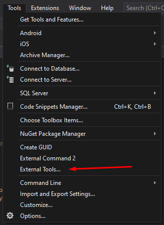

# Kraken
Утилита использует настройки взятые из октопуса.

есть два режима работы:

* получение артефактов файлов настроек из последнего релиза проекта
* получение переменных и применение их к файлам конфигов

настройка приложения возможна следующими способами

* через командную строку, возможны параметры
  * -Environment , -E - название среды
  * -SolutionFolder , -S - папка солюшена
  * -OctopusEndpoint , -OE - URI октопуса
  * -OctopusApiKey , -OK - ключ API октопуса
  * -ConfigurationPath , -C - адреса файлов конфигураций октопуса для модификации конфигов (этот параметр может содержать несколько путей к файлам чере ";", так же возможен поиск по \*)
* через передачу первым аргументом Json строки с необходимыми полями конфигурации, поля объекта аналогичны полным параметрам из предыдущего пункта
* через файл конфигурации приложения параметры аналогичны полным параметрам из первого пункта
* через переменные окружения параметры аналогичны полным параметрам из первого пункта

описание полей фала настроек:

файл настроек замен содержит массив элементов, на каждый проект октопуса можно настроить несколько замен в конфигах проекта

```json
[
{
"Id": "8682B238-65D8-43E7-98E2-E24BB739E195",
"ComponentName": "OctopusComponentName",
"PathToFile": "Path/To/File/Local/appsettings.json",
"OctopusProject": "Some Octopus Project",
"OctopusArtifactName": "SomeArtifact.json",
"IsSubstitutionsOnly": false,
"Substitutions": {
"add key=\"SomeKey\" value=\".*\"": "add key=\"SomeKey\" value=\"/\""
}
}
]
```
Для удобной работы в VS добавляем внешнюю команду



За весь код спасибо Кириллу Костыряченко. Собственно вся работа с октопусом написана им, я лишь добавил виндовую формочку
